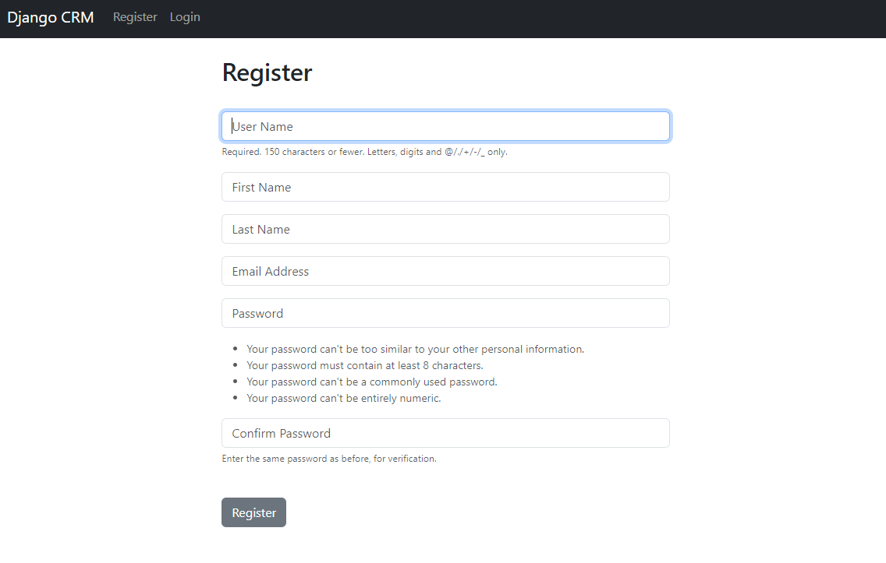

# Django-CRM-Python-APPARKY


> In this Django Project we have designed a basic CRM system 
> 
> We have agreed the terms and conditions of [Bootstrap](https://getbootstrap.com/) and have used free [Bootstrap](https://getbootstrap.com/) Templates in our work.
> 
> &nbsp; &nbsp; &nbsp; &nbsp; &nbsp; &nbsp; &nbsp; Bootstrap is a free, open source front-end development framework for the creation of websites and web apps. 
> Designed to enable responsive development of mobile-first websites, Bootstrap provides a collection of syntax for template designs.
> 
> 
> 

## Step 1:

Create a Folder first and open it from `CMD` (Windows) or your native `terminal`

Install [`Django`](https://www.djangoproject.com/) to your system by using this `command`

```commandline
pip install django
```

We have shared `requirement.txt` file with this repo. You can also install all required libraries by following this command

```commandline
pip install -r requirement.txt
```

If done, create a new project file by typing this

```commandline
django-admin startproject YOURPROJECTNAME .
# In this project is the name of it is MyCRM.
```

That's all. All your Native file will be created to yhe folder, and you are ready to start

## Step 2:

Now open the project file with the `IDLE` you like to use

Open the `terminal` from your `IDLE` and type 

```commandline
python manage.py runserver
```

> And you are good to go. Open this link form you browser [http://localhost:8001/](http://localhost:8001/)
> 
> You will see the `server` is running
> 
> 

Now Let's Create an application for our Ecommerce Page.

For Creating an Application type this to your `terminal`

```commandline
python manage.py startapplications YOURAPPLICATIONNAME
# In this project your application name is crm
```

You can see now a new folder has been created to your project directory

Now go to `MyCRM/settings.py` file you will find some list of installed application there

```commandline
INSTALLED_APPS = [
    'django.contrib.admin',
    'django.contrib.auth',
    'django.contrib.contenttypes',
    'django.contrib.sessions',
    'django.contrib.messages',
    'django.contrib.staticfiles',    
]
```

add the application name and save the file

```commandline
INSTALLED_APPS = [
    'django.contrib.admin',
    'django.contrib.auth',
    'django.contrib.contenttypes',
    'django.contrib.sessions',
    'django.contrib.messages',
    'django.contrib.staticfiles',
    
    'crm', # app name has to insert here to make it work
]
```

like this

By Default Django use `SQLite3`, but in this project we are going to use `MySQL` in stade of `SQLite3`.

First of all download `MySQL Workbench` to your System. To know how to do it you can watch [This](https://youtu.be/7S_tz1z_5bA) video Tutorial as a reference.
Click [Here](https://youtu.be/7S_tz1z_5bA) to Watch it.

Let's get back to the topic 

Now again go back to `MyCRM/settings.py` alter the `DATABASES` section with this

```commandline
DATABASES = {
    'default': {
        'ENGINE': 'django.db.backends.mysql',
        'NAME': 'my_crm', #Enter your database name here
        'USER': 'root', #Enter your username here
        'PASSWORD': '171198', #Enter your password here
        'HOST': 'localhost',
        'PORT': '3306'
    }
}
```

Now go to the `TEMPLATES` section and alter the `code` with the given billow `code`
```commandline
TEMPLATES = [
    {
        'BACKEND': 'django.template.backends.django.DjangoTemplates',
        'DIRS': ['templates'],
        'APP_DIRS': True,
        'OPTIONS': {
            'context_processors': [
                'django.template.context_processors.debug',
                'django.template.context_processors.request',
                'django.contrib.auth.context_processors.auth',
                'django.contrib.messages.context_processors.messages',
            ],
        },
    },
]
```

Now go to the `STATIC_URL` section and alter it with the given billow code
```commandline
STATIC_URL = '/static/'

MIDEA_URL = '/midea/'
MIDEA_ROOT = os.path.join(BASE_DIR, 'midea')

STATICFILES_DIRS = [
    os.path.join(BASE_DIR, 'static')
]
```
don't forget to `import os` at the top of the code.

Your `MyCRM/settings.py` has been doe setting up. Now go to `MyCRM/urls.py` and connect application url with the project.
Copy and Paste the given code to your `MyCRM/urls.py` file
```commandline
from django.contrib import admin
from django.urls import path, include

urlpatterns = [
    path('admin/', admin.site.urls),
    path('', include('crm.urls'))
]
```

You are all set up for the project directory. Let's go to the next shep

## Step 3:
In this step we are going to set up `crm/views.py`, create and setup `crm/urls.py`

Let's go to `crm/view.py` and copy & paste the following code into it
```commandline
from django.shortcuts import render, redirect
from django.http import HttpResponse

def index(request):
    return HttpResponse('Welcome to Django')
```

`crm/views.py` returns the web view, `crm/urls.py` create the `url` for that

Now go to the `cmr/urls.py` and copy and paste the following 
```commandline
from django.urls import path
from . import views

urlpatterns = [
    path('test/', views.index, name='index'),
]
```

Now run the server by the following `command` to see the web page

```commandline
python manage.py runserver
```

Click on this link [http://localhost/test/](http://localhost/test/)

This is how it looks like


Your basic app has been set up. Now let's go to next project

## Step 4:

In this step we will learn how to set up login page and user authentication

Go to `crm/view.py` file and copy and paste the given command
```commandline
def home(request):
    datas = Record.objects.all()

    if request.method == 'POST':
        username = request.POST['username']
        password = request.POST['password']

        user = authenticate(request, username=username, password=password)
        if user is not None:
            login(request, user)
            messages.success(request, 'You Have been Logged in')
            return redirect('home')

        else:
            messages.success(request, 'Login Error...!! Please try again')
            return redirect('home')
    else:
        return render(request, 'home.html', {'datas': datas})
```
but before further proceeding don't forget to import the following :

```commandline
from django.contrib.auth import authenticate, login, logout
from django.contrib import messages

```
Django has Inbuilt user authentication system. You don't have to do it manually

Now go to templates directory, all `.html` will store at here

Create an HTML file named `base.html`. and copy and paste the following :
```commandline
<!doctype html>
<html lang="en">
  <head>
    <meta charset="utf-8">
    <meta name="viewport" content="width=device-width, initial-scale=1">
    <title>
        

        
    </title>
    <link href="https://cdn.jsdelivr.net/npm/bootstrap@5.3.0/dist/css/bootstrap.min.css" rel="stylesheet" integrity="sha384-9ndCyUaIbzAi2FUVXJi0CjmCapSmO7SnpJef0486qhLnuZ2cdeRhO02iuK6FUUVM" crossorigin="anonymous">
  </head>
  <body>
    <dev class="container">

        
            
            <div class="alert alert-warning alert-dismissible fade show" role="alert">
                {{ message }}
                <button type="button" class="btn-close" data-bs-dismiss="alert" aria-label="Close"></button>
              </div>
            
        

      
      
    </dev>
    <script src="https://cdn.jsdelivr.net/npm/bootstrap@5.3.0/dist/js/bootstrap.bundle.min.js" integrity="sha384-geWF76RCwLtnZ8qwWowPQNguL3RmwHVBC9FhGdlKrxdiJJigb/j/68SIy3Te4Bkz" crossorigin="anonymous"></script>
  </body>
</html>

```

also create a `.html` file named `navbar.html`. The code for that is given billow :
```commandline
<nav class="navbar navbar-expand-lg navbar-dark bg-dark">
    <div class="container-fluid">
      <a class="navbar-brand" href="">Django CRM</a>
      <button class="navbar-toggler" type="button" data-bs-toggle="collapse" data-bs-target="#navbarSupportedContent" aria-controls="navbarSupportedContent" aria-expanded="false" aria-label="Toggle navigation">
        <span class="navbar-toggler-icon"></span>
      </button>
      <div class="collapse navbar-collapse" id="navbarSupportedContent">
        <ul class="navbar-nav me-auto mb-2 mb-lg-0">

          

          <li class="nav-item">
            <a class="nav-link" href="">Logout</a>
          </li>

          

          <li class="nav-item">
            <a class="nav-link" href="">Login</a>
          </li>

          
        </ul>
      </div>
    </div>
  </nav>

```
Now include the navbar before the `<dev class="container">` like this :
```commandline

```
The nav bar has been connected with the page.

Now create a new `.html` file named `home.html`. Code for it are given billow :
```commandline


My CRM




    

      <h1>Welcome to Django CRM..!</h1>

        

      

    

    <div class="col-md-6 offset-md-3" style="background-image: url('img/LoginPage.png')">
      <h1>Login</h1>
      
      <form class="" action="" method="post">
          
          <br/>

          <form style='backgroung-image url('img/LoginPage.png')'>
              <div class="mb-3">
                <input type="text" class="form-control" name='username' placeholder='User Name' required>
              </div>
              <div class="mb-3">
                <input type="password" class="form-control" name="password" placeholder="Password" required>
              </div>
              <br>
              <button type="submit" class="btn btn-secondary">Login</button>
            </form>

      </form>

    </div>
    




```
This is how the Login page will look like..


Before Logged in create a SuperUser for your django server. Command to create a SuperUser is :
```commandline
python manage.py createsuperuser
```

After creating a SuperUser you are able to Logged in. Django will took care of the authentication

After Logged in This is how the web page will look like..


In next We'll learn the way to Logout.


## Step 5:
Go back to `crm/views.py` create a new function for logout. Code are given billow

```commandline
def log_out(request):
    logout(request)
    messages.success(request, "You have been Successfully Logged out")
    return redirect('home')
```
Next go to `crm/urls.py` and create a new url in path like this :
```commandline
    path('logout/', views.log_out, name='logout'),
```

You don't have to edit anything in html file, we have already set up Logout section with Login

After Logged Out this is how the web page looks like


When ever you do any action like this, a message will pop upo top.

Let's move on to the next step


## Step 6:
In this step we'll set up Registration page. Create a python on `crm` directory named `forms.py`

Following code for that are give billow :
```commandline
from django.contrib.auth.forms import UserCreationForm
from django.contrib.auth.models import User
from django import forms


class SignUpForm(UserCreationForm):
    email = forms.EmailField(label='', widget=forms.TextInput(attrs={'class': 'form-control', 'placeholder': 'Email Address'}))
    first_name = forms.CharField(label='', max_length=200, widget=forms.TextInput(attrs={'class': 'form-control', 'placeholder': 'First Name'}))
    last_name = forms.CharField(label='', max_length=200, widget=forms.TextInput(attrs={'class': 'form-control', 'placeholder': 'Last Name'}))

    class Meta:
        model = User
        fields = ('username', 'first_name', 'last_name', 'email', 'password1', 'password2')

    def __init__(self, *args, **kwargs):
        super(SignUpForm, self).__init__(*args, **kwargs)

        self.fields['username'].widget.attrs['class'] = 'form-control'
        self.fields['username'].widget.attrs['placeholder'] = 'User Name'
        self.fields['username'].label = ''
        self.fields['username'].help_text = '<span class="form-text text-muted"><small>Required. 150 characters or fewer. Letters, digits and @/./+/-/_ only.</small></span>'

        self.fields['password1'].widget.attrs['class'] = 'form-control'
        self.fields['password1'].widget.attrs['placeholder'] = 'Password'
        self.fields['password1'].label = ''
        self.fields['password1'].help_text = '<ul class="form-text text-muted small"><li>Your password can\'t be too similar to your other personal information.</li><li>Your password must contain at least 8 characters.</li><li>Your password can\'t be a commonly used password.</li><li>Your password can\'t be entirely numeric.</li></ul>'

        self.fields['password2'].widget.attrs['class'] = 'form-control'
        self.fields['password2'].widget.attrs['placeholder'] = 'Confirm Password'
        self.fields['password2'].label = ''
        self.fields['password2'].help_text = '<span class="form-text text-muted"><small>Enter the same password as before, for verification.</small></span>'


```

Go to `crm/views.py` and create a function to register uew user. Following code are given billow :
```commandline
def register(request):
    if request.method == 'POST':
        form = SignUpForm(request.POST)
        if form.is_valid():
            form.save()
            username = form.cleaned_data['username']
            password = form.cleaned_data['password1']
            user = authenticate(username=username, password=password)
            login(request, user)
            messages.success(request, 'You have successfully done the Registration')
            return redirect('home')

    else:
        form = SignUpForm()
        return render(request, 'register.html', {'form': form})


```

Import the class from `crm/froms.py` in `crm/views.py` like this :
```commandline
from .forms import SignUpForm
```

Now go to `crm/urls.py` to register the url for it like this :
```commandline
path('register/', views.register, name='register'),
```

Next go to `templates/navbar.html` and create a register button for that. and the code will look like this
```commandline
<nav class="navbar navbar-expand-lg navbar-dark bg-dark">
    <div class="container-fluid">
      <a class="navbar-brand" href="">Django CRM</a>
      <button class="navbar-toggler" type="button" data-bs-toggle="collapse" data-bs-target="#navbarSupportedContent" aria-controls="navbarSupportedContent" aria-expanded="false" aria-label="Toggle navigation">
        <span class="navbar-toggler-icon"></span>
      </button>
      <div class="collapse navbar-collapse" id="navbarSupportedContent">
        <ul class="navbar-nav me-auto mb-2 mb-lg-0">

          

          <li class="nav-item">
            <a class="nav-link" href="">Logout</a>
          </li>

          

          <li class="nav-item">
            <a class="nav-link" href="">Register</a>
          </li>

          <li class="nav-item">
            <a class="nav-link" href="">Login</a>
          </li>

          
        </ul>
      </div>
    </div>
  </nav>

```

Now create a file name `register.html` on the same directory. Code for that are given billow :
```commandline



    Register Here




<div class="col-md-6 offset-md-3">
    <h2>Register</h2>
    <br>
    <form action="" method="post">
        
        
        <div class="alert alert-warning alert-dismissible fade show" role="alert">
          Your Form Has Errors
          
              
                  {{ field.errors }}
              
          
          <button type="button" class="btn-close" data-bs-dismiss="alert" aria-label="Close"></button>
        </div>
        
        {{ form.as_p }}

      <br>
      <button type="submit" class="btn btn-secondary">
          Register
      </button>
    </form>
</div>




```

You are all set. This is how the Register will look like



The like for the page will be this [http://localhost/register/](http://localhost/register/) .


## Step 7:
In this step we'll create Database. This is the easiest part on this segment. Go to `crm/model.py`, copy and paste the following codes
```commandline
from django.db import models


class Record(models.Model):
    created_at = models.DateTimeField(auto_now_add=True, null=False, blank=False)
    first_name = models.CharField(max_length=150, null=False, blank=False)
    last_name = models.CharField(max_length=150, null=False, blank=False)
    email = models.CharField(max_length=300, null=False, blank=False)
    phone = models.CharField(max_length=15, null=False, blank=False)
    address = models.CharField(max_length=500, null=False, blank=False)
    city = models.CharField(max_length=100, null=False, blank=False)
    state = models.CharField(max_length=100, null=False, blank=False)
    zipcode = models.CharField(max_length=20, null=False, blank=False)

    def __str__(self):
        return f"{self.first_name} {self.last_name}"


```

Now go to `crm/admin.py` register the database to the django admin page. Code are given billow :
```commandline
from django.contrib import admin
from .models import *

admin.site.register(Record)

```

Now go to terminal and type the following commands
```commandline
python manage.py makemigrations
python manage.py migrate
```

Your database will migrate with Django. Now go to this url [http://localhost/admin/](http://localhost/admin/)

This is how it looks like


We have already discussed how to create superuser. Logged In with your given Username and Password. 
This is how the Dashboard looks like.


Let's add some data. this is how it looks like.


To view the data go to `templates/home.html` and copy and paste the following codes :
```commandline


My CRM




    

      <h1>Welcome to Django CRM..!</h1>

      <table class="table table-striped table-hover table-bordered">
        <thead class="table-dark">
          <tr>
            <th scope="col">Name</th>
            <th scope="col">Email</th>
            <th scope="col">Phone</th>
            <th scope="col">Address</th>
            <th scope="col">City</th>
            <th scope="col">State</th>
            <th scope="col">Zipcode</th>
            <th scope="col">Created At</th>
            <th scope="col">ID</th>
          </tr>
        </thead>
        <tbody>

      

        

        <tr>
          <td>{{ data.first_name }} {{ data.last_name }}</td>
          <td>{{ data.email }}</td>
          <td>{{ data.phone }}</td>
          <td>{{ data.address }}</td>
          <td>{{ data.city }}</td>
          <td>{{ data.state }}</td>
          <td>{{ data.zipcode }}</td>
          <td>{{ data.created_at }}</td>
          <td><a href="">{{ data.id }}</a></td>
        </tr>

        

      

    

    <div class="col-md-6 offset-md-3" style="background-image: url('img/LoginPage.png')">
      <h1>Login</h1>
      
      <form class="" action="" method="post">
          
          <br/>

          <form style='backgroung-image url('img/LoginPage.png')'>
              <div class="mb-3">
                <input type="text" class="form-control" name='username' placeholder='User Name' required>
              </div>
              <div class="mb-3">
                <input type="password" class="form-control" name="password" placeholder="Password" required>
              </div>
              <br>
              <button type="submit" class="btn btn-secondary">Login</button>
            </form>

      </form>

    </div>
    




```

And this is how it looks like..


## Step 8:

In this step we'll see how to view individual Records.

Go to `crm/views.py` create a function to view the individual records like this:
```commandline
def records(request, pk):
    if request.user.is_authenticated:
        cst_records = Record.objects.get(id=pk)
        return render(request, 'records.html', {'records': cst_records})

    else:
        messages.error(request, 'Something went Wrong...!')
        return redirect('home')
```

Now go to `crm/urls.py ` and create the url for the same as this :
```commandline
path('record/<int:pk>', views.records, name='record'),
```

Now go to `templates/records.html`, codes are given billow :
```commandline



    <h1>Records</h1>

    <div class="card">
        <div class="card-header"><strong>
              {{ records.first_name }} 
              {{ records.last_name }}</strong>
        </div>
        <div class="card-body">
      
      <p class="card-text">
      <strong>Email: </strong>{{ records.email }}</p>
      
      <p class="card-text">
      <strong>Phone: </strong>{{ records.phone }}
      </p>
      
      <p class="card-text">
      <strong>Address: </strong>{{ records.address }}</p>
      
      <p class="card-text">
      <strong>City: </strong>{{ records.city }}</p>
      
      <p class="card-text">
      <strong>State: </strong>{{ records.state }}</p>
      
      <p class="card-text">
      <strong>Zipcode: </strong>{{ records.zipcode }}</p>
      
      <p class="card-text">
      <strong>Create At: </strong>{{ records.created_at }}</p>
      
      <p class="card-text">
      <strong>ID: </strong>{{ records.id }}</p>
          
          
        </div>
      </div>

      <br/><br/>
        <a href="" class="btn btn-secondary">Back</a>

        <a href="" class="btn btn-danger">Delete</a>

        <a href="" class="btn btn-dark">Update</a>


```

`Delete` and `Update` section already been added for the next section.

This is how the Page will look like.


The url for the page is [http://localhost/record/1](http://localhost/record/1) .


## Step 9:
Let's set up `Delete` and `Update` section

Go to `crm/views.py` and create function for the same as this
```commandline
def delete_cst(request, pk):
    if request.user.is_authenticated:
        delete_record = Record.objects.get(id=pk)
        delete_record.delete()

        messages.success(request, 'Records has been deleted Successfully')
        return redirect('home')

    else:
        messages.error(request, 'Something went Wrong..!!')
        return redirect('home')


def update_cst(request, pk):
    if request.user.is_authenticated:
        the_record = Record.objects.get(id=pk)
        datas = Record.objects.get(id=pk)
        form = AddRecordForm(request.POST or None, instance=the_record)
        if form.is_valid():
            form.save()
            messages.success(request, "Record Has Been Updated!")
            return redirect('home')
        return render(request, 'update.html', {'form': form})

    else:
        messages.error(request, 'Something went Wrong....!!')
        return redirect('home')


```

Go to `cmr/urls.py` to create ulr for the same like this :
```commandline
path('delete/<int:pk>', views.delete_cst, name='delete'),
path('update/<int:pk>', views.update_cst, name='update'),
```

Now create `update.html` in `templates` directory. The code for that is given billow :
```commandline



<div class="col-md-6 offset-md-3">
    <h1>Update Record</h1>
    <br/>
    
    <form method="POST">
        
    
        {{ form.as_p }}
    
    <br/>
      <button type="submit" class="btn btn-danger">Update Record</button>
        
      <a href="" class="btn btn-secondary">Back</a>

    
    </form>
    
    
    </div>
    

```

This is how it looks like..


The url for that is [http://localhost/update/1](http://localhost/update/1) .

On pressing `Delete` button, the web page will look like this.


## Step 10:

Here we'll create a section to add user

Go to `crm/views.py` create a function for the same. Code are given billow :

```commandline
def add_cst(request):
    form = AddRecordForm(request.POST or None)
    if request.user.is_authenticated:
        if request.method == 'POST':
            add = form.save()
            messages.success(request, 'Record has been Updated')
            return redirect('home')
        return render(request, 'add.html', {'form': form})

    else:
        messages.error(request, 'Something Went Wrong....!')
        return redirect('home')


```

Go to `crm/forms.py` section and create a class for adding user. Code are given billow :
```commandline
class AddRecordForm(forms.ModelForm):
    first_name = forms.CharField(required=True, widget=forms.widgets.TextInput(attrs={"placeholder":"First Name", "class":"form-control"}), label="")
    last_name = forms.CharField(required=True, widget=forms.widgets.TextInput(attrs={"placeholder":"Last Name", "class":"form-control"}), label="")
    email = forms.CharField(required=True, widget=forms.widgets.TextInput(attrs={"placeholder":"Email", "class":"form-control"}), label="")
    phone = forms.CharField(required=True, widget=forms.widgets.TextInput(attrs={"placeholder":"Phone", "class":"form-control"}), label="")
    address = forms.CharField(required=True, widget=forms.widgets.TextInput(attrs={"placeholder":"Address", "class":"form-control"}), label="")
    city = forms.CharField(required=True, widget=forms.widgets.TextInput(attrs={"placeholder":"City", "class":"form-control"}), label="")
    state = forms.CharField(required=True, widget=forms.widgets.TextInput(attrs={"placeholder":"State", "class":"form-control"}), label="")
    zipcode = forms.CharField(required=True, widget=forms.widgets.TextInput(attrs={"placeholder":"Zipcode", "class":"form-control"}), label="")

    class Meta:
        model = Record
        exclude = ("user",)

```
Now again go back to `crm/views.py` and import the class like this
```commandline
from .forms import AddRecordForm

```

Now create a file named `add.html` into `templates` directory, and copy paste the following code :
```commandline



    Add Customer



<div class="col-md-6 offset-md-3">
    <h1>Add Record</h1>
    <br/>
    
    <form method="POST" action="">
        
    
        {{ form.as_p }}
    
    <br/>
      <button type="submit" class="btn btn-secondary">Add Record</button>
       <a href="" class="btn btn-secondary">Back</a>
    
    </form>
    
    </div>

```

Now go back to `templates/navbar.html` and create a section for adding user. The code is given billow :
```commandline
          

          <li class="nav-item">
            <a class="nav-link" href="">Add Record</a>
          </li>

          <li class="nav-item">
            <a class="nav-link" href="">Logout</a>
          </li>

```

This is how the Navigation bar will look like..


This is how the Add Record Section will look like..


-------------------------------------------------------------------------------------
> 
> To get more interesting projects follow our GitHub page at [Here](https://github.com/Apparky)
> 
> To get more interesting projects follow our Bitbucket page at [Here](https://bitbucket.org/apparky-web/workspace/overview)
> 
> To know more about [__APPARKY__](https://apparky.vercel.app/) Click [Here](https://apparky.vercel.app/)
> 
> 

