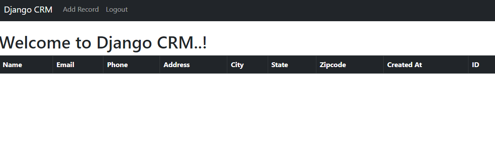
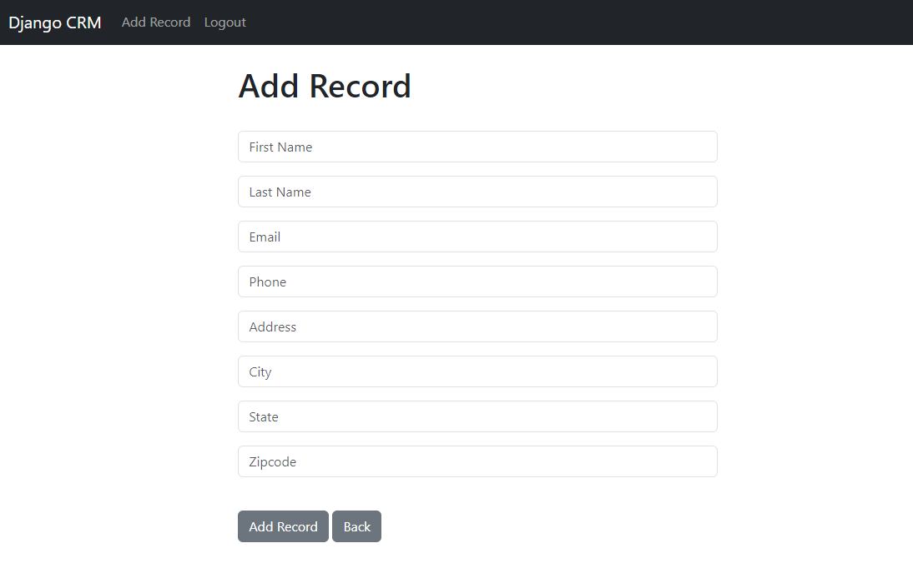

## Step 10:

Here we'll create a section to add user

Go to `crm/views.py` create a function for the same. Code are given billow :

```commandline
def add_cst(request):
    form = AddRecordForm(request.POST or None)
    if request.user.is_authenticated:
        if request.method == 'POST':
            add = form.save()
            messages.success(request, 'Record has been Updated')
            return redirect('home')
        return render(request, 'add.html', {'form': form})

    else:
        messages.error(request, 'Something Went Wrong....!')
        return redirect('home')


```

Go to `crm/forms.py` section and create a class for adding user. Code are given billow :
```commandline
class AddRecordForm(forms.ModelForm):
    first_name = forms.CharField(required=True, widget=forms.widgets.TextInput(attrs={"placeholder":"First Name", "class":"form-control"}), label="")
    last_name = forms.CharField(required=True, widget=forms.widgets.TextInput(attrs={"placeholder":"Last Name", "class":"form-control"}), label="")
    email = forms.CharField(required=True, widget=forms.widgets.TextInput(attrs={"placeholder":"Email", "class":"form-control"}), label="")
    phone = forms.CharField(required=True, widget=forms.widgets.TextInput(attrs={"placeholder":"Phone", "class":"form-control"}), label="")
    address = forms.CharField(required=True, widget=forms.widgets.TextInput(attrs={"placeholder":"Address", "class":"form-control"}), label="")
    city = forms.CharField(required=True, widget=forms.widgets.TextInput(attrs={"placeholder":"City", "class":"form-control"}), label="")
    state = forms.CharField(required=True, widget=forms.widgets.TextInput(attrs={"placeholder":"State", "class":"form-control"}), label="")
    zipcode = forms.CharField(required=True, widget=forms.widgets.TextInput(attrs={"placeholder":"Zipcode", "class":"form-control"}), label="")

    class Meta:
        model = Record
        exclude = ("user",)

```
Now again go back to `crm/views.py` and import the class like this
```commandline
from .forms import AddRecordForm

```

Now create a file named `add.html` into `templates` directory, and copy paste the following code :
```commandline



    Add Customer



<div class="col-md-6 offset-md-3">
    <h1>Add Record</h1>
    <br/>
    
    <form method="POST" action="">
        
    
        {{ form.as_p }}
    
    <br/>
      <button type="submit" class="btn btn-secondary">Add Record</button>
       <a href="" class="btn btn-secondary">Back</a>
    
    </form>
    
    </div>

```

Now go back to `templates/navbar.html` and create a section for adding user. The code is given billow :
```commandline
          

          <li class="nav-item">
            <a class="nav-link" href="">Add Record</a>
          </li>

          <li class="nav-item">
            <a class="nav-link" href="">Logout</a>
          </li>

```

This is how the Navigation bar will look like..



This is how the Add Record Section will look like..

