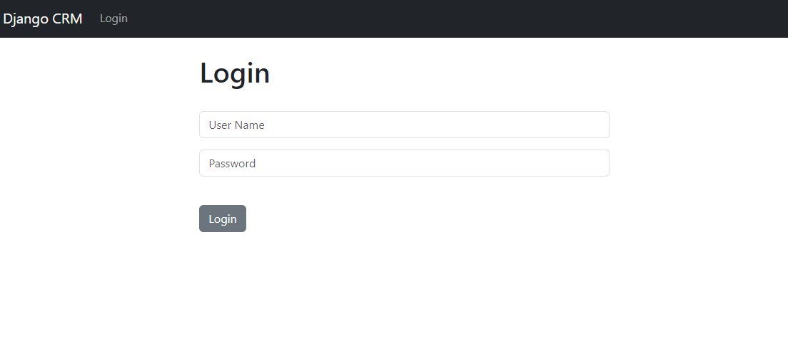

## Step 4:

In this step we will learn how to set up login page and user authentication

Go to `crm/view.py` file and copy and paste the given command
```commandline
def home(request):
    datas = Record.objects.all()

    if request.method == 'POST':
        username = request.POST['username']
        password = request.POST['password']

        user = authenticate(request, username=username, password=password)
        if user is not None:
            login(request, user)
            messages.success(request, 'You Have been Logged in')
            return redirect('home')

        else:
            messages.success(request, 'Login Error...!! Please try again')
            return redirect('home')
    else:
        return render(request, 'home.html', {'datas': datas})
```
but before further proceeding don't forget to import the following :

```commandline
from django.contrib.auth import authenticate, login, logout
from django.contrib import messages

```
Django has Inbuilt user authentication system. You don't have to do it manually

Now go to templates directory, all `.html` will store at here

Create an HTML file named `base.html`. and copy and paste the following :
```commandline
<!doctype html>
<html lang="en">
  <head>
    <meta charset="utf-8">
    <meta name="viewport" content="width=device-width, initial-scale=1">
    <title>
        

        
    </title>
    <link href="https://cdn.jsdelivr.net/npm/bootstrap@5.3.0/dist/css/bootstrap.min.css" rel="stylesheet" integrity="sha384-9ndCyUaIbzAi2FUVXJi0CjmCapSmO7SnpJef0486qhLnuZ2cdeRhO02iuK6FUUVM" crossorigin="anonymous">
  </head>
  <body>
    <dev class="container">

        
            
            <div class="alert alert-warning alert-dismissible fade show" role="alert">
                {{ message }}
                <button type="button" class="btn-close" data-bs-dismiss="alert" aria-label="Close"></button>
              </div>
            
        

      
      
    </dev>
    <script src="https://cdn.jsdelivr.net/npm/bootstrap@5.3.0/dist/js/bootstrap.bundle.min.js" integrity="sha384-geWF76RCwLtnZ8qwWowPQNguL3RmwHVBC9FhGdlKrxdiJJigb/j/68SIy3Te4Bkz" crossorigin="anonymous"></script>
  </body>
</html>

```

also create a `.html` file named `navbar.html`. The code for that is given billow :
```commandline
<nav class="navbar navbar-expand-lg navbar-dark bg-dark">
    <div class="container-fluid">
      <a class="navbar-brand" href="">Django CRM</a>
      <button class="navbar-toggler" type="button" data-bs-toggle="collapse" data-bs-target="#navbarSupportedContent" aria-controls="navbarSupportedContent" aria-expanded="false" aria-label="Toggle navigation">
        <span class="navbar-toggler-icon"></span>
      </button>
      <div class="collapse navbar-collapse" id="navbarSupportedContent">
        <ul class="navbar-nav me-auto mb-2 mb-lg-0">

          

          <li class="nav-item">
            <a class="nav-link" href="">Logout</a>
          </li>

          

          <li class="nav-item">
            <a class="nav-link" href="">Login</a>
          </li>

          
        </ul>
      </div>
    </div>
  </nav>

```
Now include the navbar before the `<dev class="container">` like this :
```commandline

```
The nav bar has been connected with the page.

Now create a new `.html` file named `home.html`. Code for it are given billow :
```commandline


My CRM




    

      <h1>Welcome to Django CRM..!</h1>

        

      

    

    <div class="col-md-6 offset-md-3" style="background-image: url('img/LoginPage.png')">
      <h1>Login</h1>
      
      <form class="" action="" method="post">
          
          <br/>

          <form style='backgroung-image url('img/LoginPage.png')'>
              <div class="mb-3">
                <input type="text" class="form-control" name='username' placeholder='User Name' required>
              </div>
              <div class="mb-3">
                <input type="password" class="form-control" name="password" placeholder="Password" required>
              </div>
              <br>
              <button type="submit" class="btn btn-secondary">Login</button>
            </form>

      </form>

    </div>
    




```
This is how the Login page will look like..



Before Logged in create a SuperUser for your django server. Command to create a SuperUser is :
```commandline
python manage.py createsuperuser
```

After creating a SuperUser you are able to Logged in. Django will took care of the authentication

After Logged in This is how the web page will look like..


In next We'll learn the way to Logout

