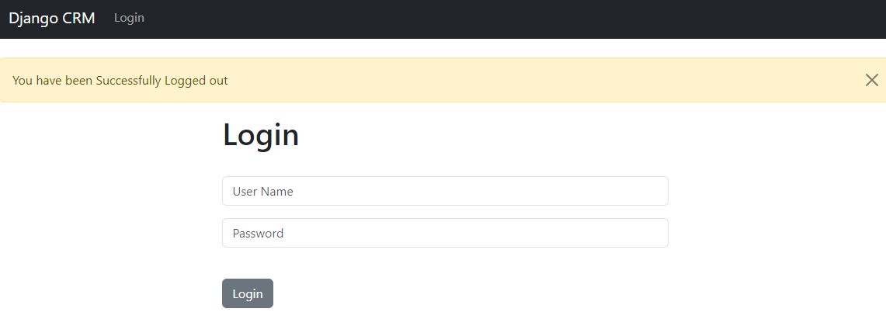

## Step 5:
Go back to `crm/views.py` create a new function for logout. Code are given billow

```commandline
def log_out(request):
    logout(request)
    messages.success(request, "You have been Successfully Logged out")
    return redirect('home')
```
Next go to `crm/urls.py` and create a new url in path like this :
```commandline
    path('logout/', views.log_out, name='logout'),
```

You don't have to edit anything in html file, we have already set up Logout section with Login

After Logged Out this is how the web page looks like



When ever you do any action like this, a message will pop upo top.

Let's move on to the next step


