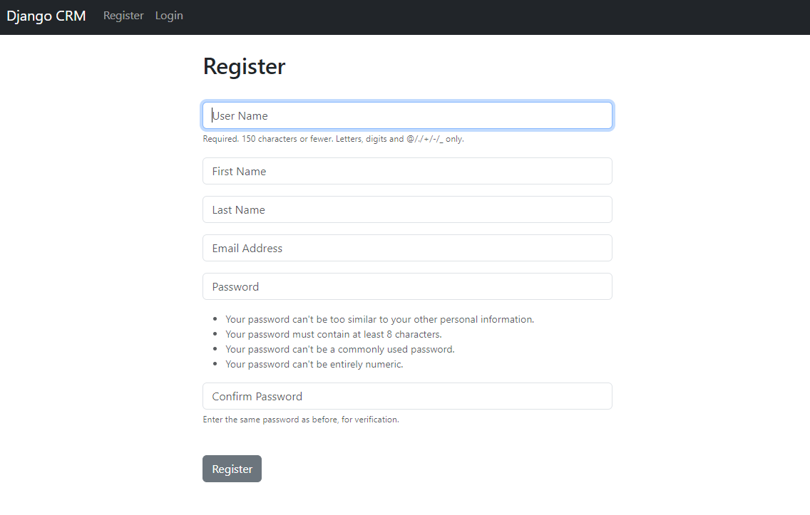

## Step 6:
In this step we'll set up Registration page. Create a python on `crm` directory named `forms.py`

Following code for that are give billow :
```commandline
from django.contrib.auth.forms import UserCreationForm
from django.contrib.auth.models import User
from django import forms


class SignUpForm(UserCreationForm):
    email = forms.EmailField(label='', widget=forms.TextInput(attrs={'class': 'form-control', 'placeholder': 'Email Address'}))
    first_name = forms.CharField(label='', max_length=200, widget=forms.TextInput(attrs={'class': 'form-control', 'placeholder': 'First Name'}))
    last_name = forms.CharField(label='', max_length=200, widget=forms.TextInput(attrs={'class': 'form-control', 'placeholder': 'Last Name'}))

    class Meta:
        model = User
        fields = ('username', 'first_name', 'last_name', 'email', 'password1', 'password2')

    def __init__(self, *args, **kwargs):
        super(SignUpForm, self).__init__(*args, **kwargs)

        self.fields['username'].widget.attrs['class'] = 'form-control'
        self.fields['username'].widget.attrs['placeholder'] = 'User Name'
        self.fields['username'].label = ''
        self.fields['username'].help_text = '<span class="form-text text-muted"><small>Required. 150 characters or fewer. Letters, digits and @/./+/-/_ only.</small></span>'

        self.fields['password1'].widget.attrs['class'] = 'form-control'
        self.fields['password1'].widget.attrs['placeholder'] = 'Password'
        self.fields['password1'].label = ''
        self.fields['password1'].help_text = '<ul class="form-text text-muted small"><li>Your password can\'t be too similar to your other personal information.</li><li>Your password must contain at least 8 characters.</li><li>Your password can\'t be a commonly used password.</li><li>Your password can\'t be entirely numeric.</li></ul>'

        self.fields['password2'].widget.attrs['class'] = 'form-control'
        self.fields['password2'].widget.attrs['placeholder'] = 'Confirm Password'
        self.fields['password2'].label = ''
        self.fields['password2'].help_text = '<span class="form-text text-muted"><small>Enter the same password as before, for verification.</small></span>'


```

Go to `crm/views.py` and create a function to register uew user. Following code are given billow :
```commandline
def register(request):
    if request.method == 'POST':
        form = SignUpForm(request.POST)
        if form.is_valid():
            form.save()
            username = form.cleaned_data['username']
            password = form.cleaned_data['password1']
            user = authenticate(username=username, password=password)
            login(request, user)
            messages.success(request, 'You have successfully done the Registration')
            return redirect('home')

    else:
        form = SignUpForm()
        return render(request, 'register.html', {'form': form})


```

Import the class from `crm/froms.py` in `crm/views.py` like this :
```commandline
from .forms import SignUpForm
```

Now go to `crm/urls.py` to register the url for it like this :
```commandline
    path('logout/', views.log_out, name='logout')

```

Next go to `templates/navbar.html` and create a register button for that. and the code will look like this
```commandline
<nav class="navbar navbar-expand-lg navbar-dark bg-dark">
    <div class="container-fluid">
      <a class="navbar-brand" href="">Django CRM</a>
      <button class="navbar-toggler" type="button" data-bs-toggle="collapse" data-bs-target="#navbarSupportedContent" aria-controls="navbarSupportedContent" aria-expanded="false" aria-label="Toggle navigation">
        <span class="navbar-toggler-icon"></span>
      </button>
      <div class="collapse navbar-collapse" id="navbarSupportedContent">
        <ul class="navbar-nav me-auto mb-2 mb-lg-0">

          

          <li class="nav-item">
            <a class="nav-link" href="">Logout</a>
          </li>

          

          <li class="nav-item">
            <a class="nav-link" href="">Register</a>
          </li>

          <li class="nav-item">
            <a class="nav-link" href="">Login</a>
          </li>

          
        </ul>
      </div>
    </div>
  </nav>

```

Now create a file name `register.html` on the same directory. Code for that are given billow :
```commandline



    Register Here




<div class="col-md-6 offset-md-3">
    <h2>Register</h2>
    <br>
    <form action="" method="post">
        
        
        <div class="alert alert-warning alert-dismissible fade show" role="alert">
          Your Form Has Errors
          
              
                  {{ field.errors }}
              
          
          <button type="button" class="btn-close" data-bs-dismiss="alert" aria-label="Close"></button>
        </div>
        
        {{ form.as_p }}

      <br>
      <button type="submit" class="btn btn-secondary">
          Register
      </button>
    </form>
</div>




```

You are all set. This is how the Register will look like



The like for the page will be this [http://localhost/register/](http://localhost/register/) .

