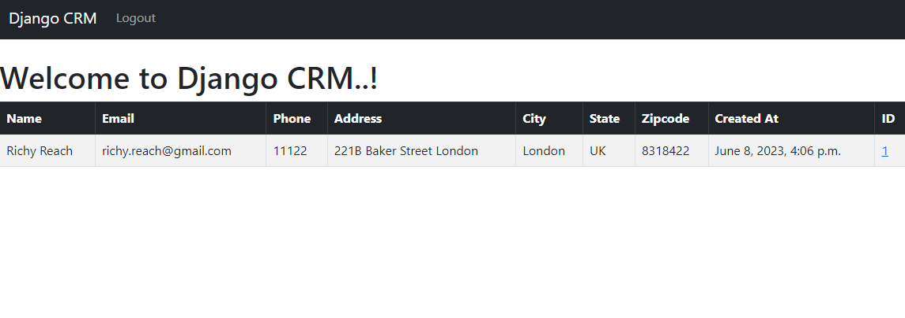

## Step 7:
In this step we'll create Database. This is the easiest part on this segment. Go to `crm/model.py`, copy and paste the following codes
```commandline
from django.db import models


class Record(models.Model):
    created_at = models.DateTimeField(auto_now_add=True, null=False, blank=False)
    first_name = models.CharField(max_length=150, null=False, blank=False)
    last_name = models.CharField(max_length=150, null=False, blank=False)
    email = models.CharField(max_length=300, null=False, blank=False)
    phone = models.CharField(max_length=15, null=False, blank=False)
    address = models.CharField(max_length=500, null=False, blank=False)
    city = models.CharField(max_length=100, null=False, blank=False)
    state = models.CharField(max_length=100, null=False, blank=False)
    zipcode = models.CharField(max_length=20, null=False, blank=False)

    def __str__(self):
        return f"{self.first_name} {self.last_name}"


```

Now go to `crm/admin.py` register the database to the django admin page. Code are given billow :
```commandline
from django.contrib import admin
from .models import *

admin.site.register(Record)

```

Now go to terminal and type the following commands
```commandline
python manage.py makemigrations
python manage.py migrate
```

Your database will migrate with Django. Now go to this url [http://localhost/admin/](http://localhost/admin/)

This is how it looks like


We have already discussed how to create superuser. Logged In with your given Username and Password. 
This is how the Dashboard looks like.


Let's add some data. this is how it looks like.


To view the data go to `templates/home.html` and copy and paste the following codes :
```commandline


My CRM




    

      <h1>Welcome to Django CRM..!</h1>

      <table class="table table-striped table-hover table-bordered">
        <thead class="table-dark">
          <tr>
            <th scope="col">Name</th>
            <th scope="col">Email</th>
            <th scope="col">Phone</th>
            <th scope="col">Address</th>
            <th scope="col">City</th>
            <th scope="col">State</th>
            <th scope="col">Zipcode</th>
            <th scope="col">Created At</th>
            <th scope="col">ID</th>
          </tr>
        </thead>
        <tbody>

      

        

        <tr>
          <td>{{ data.first_name }} {{ data.last_name }}</td>
          <td>{{ data.email }}</td>
          <td>{{ data.phone }}</td>
          <td>{{ data.address }}</td>
          <td>{{ data.city }}</td>
          <td>{{ data.state }}</td>
          <td>{{ data.zipcode }}</td>
          <td>{{ data.created_at }}</td>
          <td><a href="">{{ data.id }}</a></td>
        </tr>

        

      

    

    <div class="col-md-6 offset-md-3" style="background-image: url('img/LoginPage.png')">
      <h1>Login</h1>
      
      <form class="" action="" method="post">
          
          <br/>

          <form style='backgroung-image url('img/LoginPage.png')'>
              <div class="mb-3">
                <input type="text" class="form-control" name='username' placeholder='User Name' required>
              </div>
              <div class="mb-3">
                <input type="password" class="form-control" name="password" placeholder="Password" required>
              </div>
              <br>
              <button type="submit" class="btn btn-secondary">Login</button>
            </form>

      </form>

    </div>
    




```

And this is how it looks like..



