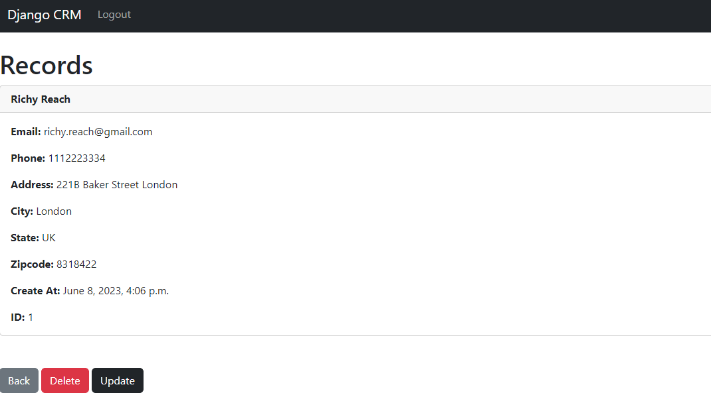

## Step 8:

In this step we'll see how to view individual Records.

Go to `crm/views.py` create a function to view the individual records like this:
```commandline
def records(request, pk):
    if request.user.is_authenticated:
        cst_records = Record.objects.get(id=pk)
        return render(request, 'records.html', {'records': cst_records})

    else:
        messages.error(request, 'Something went Wrong...!')
        return redirect('home')
```

Now go to `crm/urls.py ` and create the url for the same as this :
```commandline
path('record/<int:pk>', views.records, name='record'),
```

Now go to `templates/records.html`, codes are given billow :
```commandline



    <h1>Records</h1>

    <div class="card">
        <div class="card-header"><strong>
              {{ records.first_name }} 
              {{ records.last_name }}</strong>
        </div>
        <div class="card-body">
      
      <p class="card-text">
      <strong>Email: </strong>{{ records.email }}</p>
      
      <p class="card-text">
      <strong>Phone: </strong>{{ records.phone }}
      </p>
      
      <p class="card-text">
      <strong>Address: </strong>{{ records.address }}</p>
      
      <p class="card-text">
      <strong>City: </strong>{{ records.city }}</p>
      
      <p class="card-text">
      <strong>State: </strong>{{ records.state }}</p>
      
      <p class="card-text">
      <strong>Zipcode: </strong>{{ records.zipcode }}</p>
      
      <p class="card-text">
      <strong>Create At: </strong>{{ records.created_at }}</p>
      
      <p class="card-text">
      <strong>ID: </strong>{{ records.id }}</p>
          
          
        </div>
      </div>

      <br/><br/>
        <a href="" class="btn btn-secondary">Back</a>

        <a href="" class="btn btn-danger">Delete</a>

        <a href="" class="btn btn-dark">Update</a>


```

`Delete` and `Update` section already been added for the next section.

This is how the Page will look like.



The url for the page is [http://localhost/record/1](http://localhost/record/1) .

